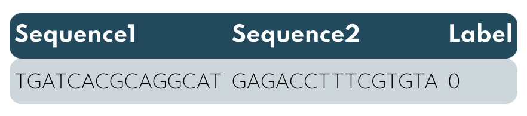
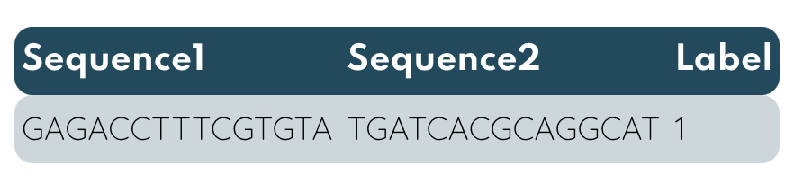

<!-- PROJECT SHIELDS -->
<!--
*** https://www.markdownguide.org/basic-syntax/#reference-style-links
-->


[![Stargazers][stars-shield]][stars-url]
[![Forks][forks-shield]][forks-url]
[![Contributors][contributors-shield]][contributors-url]
[![Issues][issues-shield]][issues-url]
[![License][license-shield]][license-url]

<p align="center">
  

  <h3 align="center">Transformers Enhanced Aptamer Design Software </h3>

  <p align="center">
    An jumpstart to fit aptamers!
    <br />
    <a href="https://igem2021.vilnius.com/"><strong>Explore Our Wiki »</strong></a>
    <br />
    <a href="https://github.com/">Create Issue</a>
  </p>
  
</p>


<!-- TABLE OF CONTENTS -->
<details open="open">
  <summary>Table of Contents</summary>
  <ol>
    <li>
      <a href="#motivation">Motivation</a>
    </li>
    <li>
      <a href="#model-dataflow">Model Dataflow</a>
    </li>
    <li><a href="#results">Results</a></li>
    <li><a href="#getting-starter">Getting Started</a></li>
        <ul>
        <li><a href="#prerequisites">Prerequisites</a></li>
        <li><a href="#installation">Installation</a></li>
      </ul>
    <li><a href="#contributing">Contributing</a></li>
    <li><a href="#license">License</a></li>
    <li><a href="#contact">Contact</a></li>
  </ol>
</details>

Suggestion for future improvements

<!-- ABOUT THE PROJECT -->
## Motivation
----
Our team this year decided to create an aptamer-based detection method to diagnose amebiasis disease caused by <em>Entamoeba histolytica</em>. Nevertheless, SELEX (Systematic evolution of ligands by exponential enrichment) was chosen as the main approach used to find aptamers for the protein target indicating the presence of <em>E. histolytica.</em>  

Finding a suitable aptamer by the well-established SELEX method requires to set up the appropriate protocols, and might be a laborious and costly procedure. Keeping these reasons in mind, we started to look for <em>in silico</em> approaches for aptamer generation. After studying existing literature resources, we found methods like M.A.W.S. (Making aptamers without SELEX), which was implemented by Heidelberg iGEM 2015 team. Based on this approach, we released an updated version that is described in the [Software page](https://2021.igem.org/Team:Vilnius-Lithuania/Software).

We decided to take a step further and apply a novel transformer-based neural network model  combined with a genetic algorithm to make aptamer generation <em>in silico</em> a more resource-efficient process that has the higher potential to output an affine aptamer sequence. The key part of the model is that it has a property of transfer learning that lets anyone fine-tune the model almost instantly for modified tasks.


Transformers Enhanced Aptamers (*TEA*) software is an extension of the EFBALite that speeds up the kinetic aptamer evaluation by 40 times and enables quick iterative inference on sequences. Genetic algorithm (GA) can be introduced to help out *TEA* to generate *TOP* aptamers for a target protein. The key property of the model - the transfer learning - can be employed to fine-tune (re-train) the model for any target protein of interest without need of re-inventing the wheel which requires expensive GPUs and is not accessible to everyone. To add up, many transformer-based models could fit the task of generating aptamers, however we have to be smarter about the way we use our resources, therefore Albert model was chosen because of its state of the Art performance with fewer parameters (11M) than the threshold BERT model (110M). Albert takes ~10 times less time to train, fine-tune or inference, saving days of expensive GPU runtime which can cost up to 2-3k$ per month (2x`16 GB Tesla V100`). Time is the crucial reasoning when one has to work with huge datasets. 

The model presented here was created for albumin to generate 15 nucleotide long sequences.

## Model Dataflow

Initially, N random aptamer sequences are generated employing EFBAScore. Then data must be specifically preprocessed to contain a pair of aptamers with a binary label that determines if the first sequence is more fit (1) or not (0). 

<p align="center">
  
</p>

### Model Dataflow
-----
Initially, N random aptamer sequences are generated employing ELBAScore software. Following it up, data must be specifically preprocessed to contain a pair of aptamers with a binary label that determines if the second sequence is more fit (1) or not (0).

The dataset of paired sequences is obtained by comparing every aptamer in-between by fitness score, which is computed with the former software.
Later on, the number of classification classes labels are balanced by flipping aptamers places for BERT model to learn both classes equally.

Many transformer-based models could fit this task, however Albert model was chosen because of its state of the Art performance with fewer parameters than the threshold BERT model, which takes 4-5 times less time to train, saving days of expensive GPU runtime. Working with huge datasets like ours time is the main reasoning for choosing Albert. 

Another significant part of the model is the genetic algorithm (GA) that produces new sequences at every iteration by well-known breeding and mutation steps. Additionally, GAs probabilistic model helped to determine the convergence and how many iterations the process requires to produce the final aptamer list which consists of N aptamers to be investigated further. 

Lastly, the sequences of the final iteration are analyzed and compared by ELBAScore. Furthermore the top 10 % of total will be reevaluated in the lab.


## Results
-----
Two separate models were created for protein targets albumin and EhPPDK. Here the transfer learning helped out - we had to train a model only on an albumin dataset for 2.5 days on 1 GPU and later on only to fine-tune the same Albert model with EhPPDK protein target dataset. This approach saved us some time, since it took ~3 hours for the model to relearn positional embedding to inference partially different data. 

The initial model itself was trained on 1500 different aptamer sequences data from ELBAScore, which formed 1,124,250 pairs with binary labels, 60% of it was used for training matter, 20 % for validation, and the remaining 20% for testing. To inference a new population of aptamers Albert takes approximately 5 minutes. [metrikos] + [top aptameru iverciai su ELBALite, kokia dalis nukeliavo i labe] + [gal dar kazkokius iteracinius/tarpinius duomenis] + [pabrezti kaip efektino] + [distribucijos issemimas]
The dataset of paired sequences is obtained by comparing every aptamer in-between by fitness score which was computed with the former software. Later on, if needed, the number of classification classes labels is balanced by flipping label by switching places of the first aptamer and the second aptamer. The balance is needed for model to master both classes equally good. 

<p align="center">
  
</p>
<p align="center">
  
</p>

Next, paired aptamers are put to the GA that produces new sequences from the the most fit by breeding and mutation steps. In brief, GA conditions the new breed to have properties of the "best". New list of aptamers are evaluated by TEA, the best 10 percent stays and we iteratively repeat the process until the process converges and we are satisfied with probabilities of model to have at least few super affine sequences to the target protein. Final aptamers can be send to wet lab to confirm its superiority after the last EFBALite is performed on it. *Every result can be reproduced using seed*.

##  Modeling 

Whole NN with GA have been modeled with Bayesian inference methods to determine can process converge and if so how long it would take; also stability of iterative algortihm have been taken in consideration to determine what exact accuracy level of Albert we have to train to ensure fitness of process. Read more in `./genetic_algorithm/`.


## Results
Fine-tuning two models with various hyperparameters took less than 12 hours, which was enough for a model to learn the positional embeddings difference between natural Language and the language of proteins. Dataset for learning part consisted of 1500 different aptamer sequences from EFBAScore, which were later on paired to form 433050 pairs with binary labels, 70 percent of it was used for training, 15 percent for validation, and the rest for testing. 

Comparing the accuracy and other significant metrics of the fine-tuned `albert-base-v2` and `albert-large-v2` models for albumin, large version had an edge over the base one just by 4 percent, although it took almost twice as long compared to its simpler version to make inferences. Due to the mentioned reasons, `albert-base-v2` was chosen.

<p align="middle">
   
  
</p>

<p align="middle">

</p>

Albert is capable of evaluating 800 aptamers per iteration which takes from 7 to 8 minutes.


<!-- GETTING STARTED -->
## Getting Started

----
This is an example of how you may give instructions on setting up your project locally. In order to run the model locally, follow these simple example steps.

### Prerequisites & Installation
----
To quickly install all packages required for algorithm run:

```
pip install requirements.txt
```

In case you are running on cloud there is a perfect [tutorial](https://medium.com/analytics-vidhya/install-cuda-11-2-cudnn-8-1-0-and-python-3-9-on-rtx3090-for-deep-learning-fcf96c95f7a1) on how to install every dependency you might need to train a deep learning model. These dependencies include Cuda, CudaNN, and PyTorch. However, if you have no access to cloud GPU instances, we strongly suggest to utilize [Google Colab](https://link-url-here.org).

<!-- USAGE EXAMPLES -->
## Usage
----
Project can be used in two ways. In case you have the same type of dataset and the task to work on, the model is shared in the AI community [HuggingFace](https://huggingface.co/models) by name "VilniusIGEM2021/albert-base-aptamers". One command to rule them all and inference as with usual transformer-based model:


```
model = AutoModel.from_pretrained('Vilnius-Lithuania-iGEM2021/Albumin')
```

More information related to this flow can be found in [HuggingFace/Transformers](https://huggingface.co/transformers/). 

Otherwise, if task differs, for example in case of the longer aptamer sequences or it is required to change the task from classification to sequence generation, then you have to run the process described in `model` folder with changed initial `albert-case-v2` model to `VilniusIGEM2021/albert-base-aptamers`.

_For more in-depth ALBERT model description and explanation, please refer to the [ALBERT Documentation.](https://github.com/saulius-lipkevicius/GA_Transformer/tree/main/model)_

##  Suggestion for future improvements

  - Optimizing number of aptamers taken in every sequence by common derivate calculation:
  - Optimizing with exporting to ONNX
  - Otimizing by diminishing accuracy to INT8
  - Change structure of comparing
  - Change algorithm flow

-  Train Albert from scratch on a way bigger dataset.
-  Test out other BERT alternatives like Roberta (this model specifically requires up to 10 times more data than BERT or Albert).
- To make model more precise, 3 class model could be considered instead of 2 classes. The third could stand for an unknown relationship between pair of aptamers.
- Freeze layers of Albert to maximize accuracy, there is a code snippet in the model fine-tuning for experimenting.
- Play with hyperparameters: prediction threshold, learning rate and optimizer, learning rate, gradient accumulation parameter (`iters_to_accumulate`) and so on.
- Try out different *seeds* for the same model, sometimes random initial state can change results significantly.
- Model code can be rewriten to TensorFlow.
-  Speed up the neural network by diminishing parameters accuracy to INT8.
-  Create a tokenizer that would learn to seperate aptamer sequence uniquely. [Link for a head-start](https://huggingface.co/quicktour/transformers).
- If your goal is to create a model of higher better accuracy, play around with GA parameters, since with accuracy we need less restrictions for GA.
- Flow can be rewritten to C++ language to speed up the work with dataframes and intermediate calculations.
- Analyze the accuracy of the model when sequences of similar affinity scores are compared. 

<!-- CONTRIBUTING -->
## Contributing
----
Contributions are what make the open source community such an amazing place to learn, inspire, and create. Any contributions you make are **greatly appreciated**. 

In order to contribute, please follow the steps below:

1. Fork the project
2. Create your feature branch (`git checkout -b feature/CuteAptamer`)
3. Commit your changes (`git commit -m 'Add my feature'`)
4. Push to the branch (`git push origin feature/CuteAptamer`)
5. Open a pull request

###  Contributing to HuggingFace
Any contribution to the AI community HuggingFacce community is super valuable, find more information in [HuggingFace/Contributing.](https://huggingface.co/transformers/contributing.html)


Contributions are what makes the open source community such an amazing place for learning, inspiration, and creating. Any contributions you make are **greatly appreciated**.

1. Fork the project
2. Create your feature branch (`git checkout -b feature/CuteAptamer`)
3. Commit your changes (`git commit -m 'Add my feature'`)
4. Push to the branch (`git push origin feature/CuteAptamer`)
5. Open a pull request


###  Suggestion for future improvements

  1. Model code can be rewriten to TensorFlow.
  2. Different transformer-based models can be tried out, for instance, RoBerta, GPT-2 and so on.
  3. To make model more precise, a model embedding 3 classes instead of 2 could be considered. The third class could stand for the unknown relationship between a pair of aptamers.
   
###  Contributing to HuggingFace
Any contribution to the AI community HuggingFacce community is extremely valuable, find more information in [HuggingFace/Contributing](https://huggingface.co/transformers/contributing.html)


<!-- LICENSE -->
## License
Distributed under the MIT License. See `LICENSE` for more information.

<!-- CONTACT -->
## Contact
Saulius Lipkevičius - sauliuslipkevicius@gmail.com


<!-- MARKDOWN LINKS & IMAGES -->
<!-- https://www.markdownguide.org/basic-syntax/#reference-style-links -->
[contributors-shield]: https://img.shields.io/github/contributors/othneildrew/Best-README-Template.svg?style=for-the-badge
[contributors-url]: https://github.com/othneildrew/Best-README-Template/graphs/contributors
[forks-shield]: https://img.shields.io/github/forks/othneildrew/Best-README-Template.svg?style=for-the-badge
[forks-url]: https://github.com/othneildrew/Best-README-Template/network/members
[stars-shield]: https://img.shields.io/github/stars/othneildrew/Best-README-Template.svg?style=for-the-badge
[stars-url]: https://github.com/othneildrew/Best-README-Template/stargazers
[issues-shield]: https://img.shields.io/github/issues/othneildrew/Best-README-Template.svg?style=for-the-badge
[issues-url]: https://github.com/othneildrew/Best-README-Template/issues
[license-shield]: https://img.shields.io/github/license/othneildrew/Best-README-Template.svg?style=for-the-badge
[license-url]: https://github.com/othneildrew/Best-README-Template/blob/master/LICENSE.txt
[product-screenshot]: images/screenshot.png
