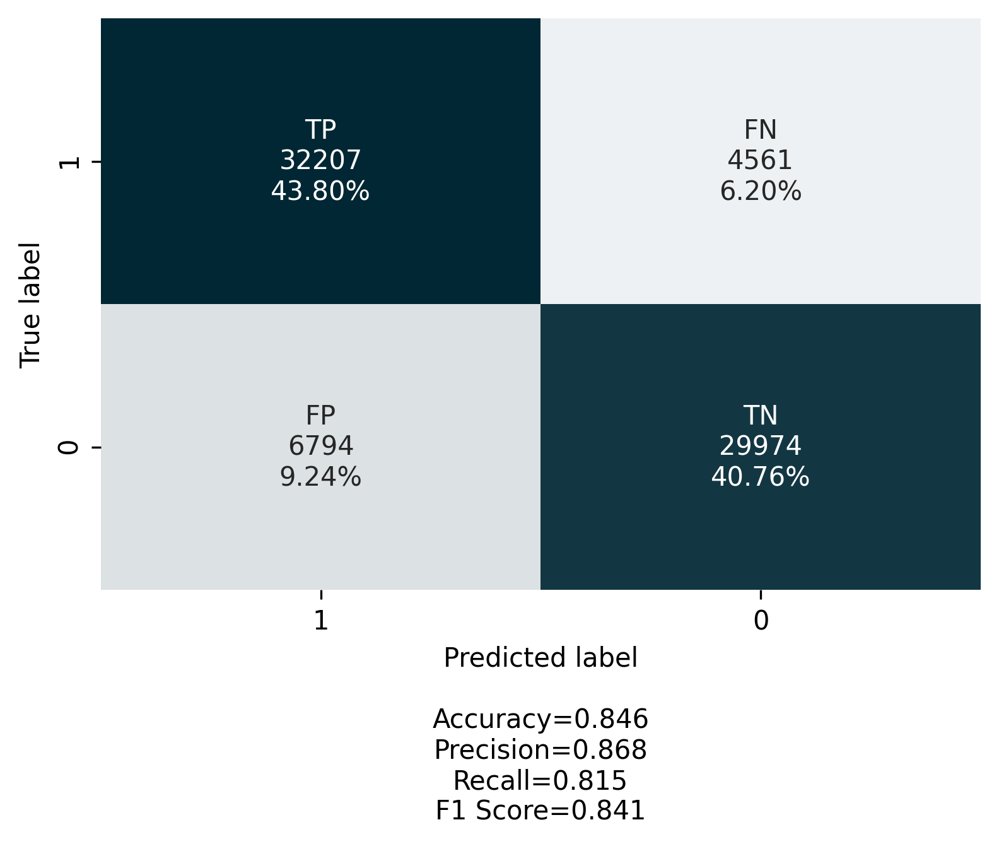

<!-- PROJECT SHIELDS -->
<!--
*** https://www.markdownguide.org/basic-syntax/#reference-style-links
-->


[![Stargazers][stars-shield]][stars-url]
[![Forks][forks-shield]][forks-url]
[![Contributors][contributors-shield]][contributors-url]
[![Issues][issues-shield]][issues-url]
[![License][license-shield]][license-url]

<p align="center">
  

  <h3 align="center">Transformers Enhanced Aptamer Design Software </h3>

  <p align="center">
    An jumpstart to fit aptamers!
    <br />
    <a href="https://igem2021.vilnius.com/"><strong>Explore Our Wiki »</strong></a>
    <br />
    <a href="https://github.com/">Create Issue</a>
  </p>
  
</p>


<!-- TABLE OF CONTENTS -->
<details open="open">
  <summary>Table of Contents</summary>
  <ol>
    <li>
      <a href="#motivation">Motivation</a>
    </li>
    <li>
      <a href="#model-dataflow">Model Dataflow</a>
    </li>
    <li><a href="#results">Results</a></li>
    <li><a href="#getting-starter">Getting Started</a></li>
        <ul>
        <li><a href="#prerequisites">Prerequisites</a></li>
        <li><a href="#installation">Installation</a></li>
      </ul>
    <li><a href="#contributing">Contributing</a></li>
    <li><a href="#license">License</a></li>
    <li><a href="#contact">Contact</a></li>
    <li><a href="#acknowledgements">Acknowledgements</a></li>
  </ol>
</details>


<!-- ABOUT THE PROJECT -->
## Motivation

This transformer-based neural network software is the ELBALite extension that speedup kinetic aptamer evaluation by 20 times and enables quick iterative inference on sequences. In consequence, genetic algorithm (GA) can be introduced to help out TEA to generate TOP aptamers for target protein also worth mentioning, models key property of transfer learning can be employed to fine-tune (re-train) it for any target protein of interest without need of expensive GPUs. To add up, many transformer-based models could fit this task, however Albert model was chosen because of its state of the Art performance with fewer parameters (11M) than threshold BERT model (110M), which takes ~10 times less time to train, fine-tune or inference, saving days of expensive GPU runtime. Working with massive datasets like our time is the crucial reasoning. 

### Model Dataflow

Initially N random aptamer sequences are generated employing ELBAScore, following it up, data must be specifically preprocessed to contain a pair of aptamers with a binary label that determines if the first sequence is more fit (1) or not (0). 

<p align="center">
  
</p>

Paired sequences dataset is obtained by comparing every aptamer in-between by fitness score which is computed with the former software, later number of classification classes labels are balanced (if needed) by flipping Label together with exhanging first aptamer with the second in places for model to master both classes equally good. 

Next, paired aptamers are put to the GA that produces new sequences from the the most fit by by well-known breeding, mutation steps, shortly speaking, GA conditions new breed to have properties of the "best". New list of aptamers are evaluated by TEA, 10 % of the best stays and we iteratively repeat the process until it converges and we are satisfied with probabilities of model to have at least few super fit sequences to target protein of interest. Final aptamers can be send to wet lab to confirm its superiority after the last ELBALite run on it.


## Results
-----

Two separate models were created for protein targets Albumin and EhPPDK. Here transfer learning helped out, we had to train a model only on Albumin dataset for 2.5 days on 1 GPU and later on fine-tune the same Albert model with EhPPDK protein target dataset to save time, it took ~3 hours, because the model just needs to relearn positional embedding to inference partially different data. Initial model itself was trained on 1500 different aptamer sequences data from ELBAScore which formed 1,124,250 pairs with binary labels, 60% of it was used for training matter, 20 % for validation, and the rest for testing. To inference a new population of aptamers Albert takes approximately 5 minutes. [ikelti image of losses from training] + [metrikos] + [top aptameru iverciai su ELBALite, kokia dalis nukeliavo i labe] + [gal dar kazkokius iteracinius/tarpinius duomenis] + [pabrezti kaip efektino] + [distribucijos issemimas]


  |  


<p align="middle">
  
   
  
</p>


<figure>
<figcaption align = "center"><b>Target protein Albumin and EhPPDK-Albumin model ROC curves</b></figcaption></figure>

<figure>
<figcaption align = "center"><b>Target protein Albumin and EhPPDK-Albumin model confusion matrices</b></figcaption></figure>


<!-- GETTING STARTED -->
## Getting Started
----
This is an example of how you may give instructions on setting up your project locally.
To get a local copy up and running follow these simple example steps.

### Prerequisites & Installation
----
To quickly install all packages required for algorithm run 
```
pip install requirements.txt
```

In case you are running on cloud there is perfect [tutorial](https://medium.com/analytics-vidhya/install-cuda-11-2-cudnn-8-1-0-and-python-3-9-on-rtx3090-for-deep-learning-fcf96c95f7a1) how to install every dependancy you can need training deep learning model, that includes Cuda, CudaNN, PyTorch. However if you have no access to cloud GPU instances, we strongly suggest to utilize [Google Colab](https://link-url-here.org).


<!-- USAGE EXAMPLES -->
## Usage
----
Project can be used in two ways. In case you have the same type of dataset and task to work on, model is shared in the AI community [HuggingFace](https://huggingface.co/models) by name "VilniusIGEM2021/albert-base-aptamers". One command to rule them all

```
model = AutoModel.from_pretrained('VilniusIGEM2021/albert-base-aptamers')
```

and inference as with usual transformer-based model. Read more on everything covering tutorial can be found in [HuggingFace/Transformers](https://huggingface.co/transformers/). Otherwise, if task differs, for instance you are considering longer aptamer sequences or change task from classification to sequence generation, then you have to run the process described in `model` folder with changed initial `albert-case-v2` model to `VilniusIGEM2021/albert-base-aptamers`

_For more indepth ALBERT model description and explanation, please refer to the [ALBERT Documentation](https://github.com/saulius-lipkevicius/GA_Transformer/tree/main/model)_


## V2.0 Optimization

  - Optimizing number of aptamers taken in every sequence by common derivate calculation:
  - Optimizing with exporting to ONNX
  - Otimizing by diminishing accuracy to INT8
  - Change structure of comparing
  - change algorithm flow


<!-- CONTRIBUTING -->
## Contributing
----
Contributions are what make the open source community such an amazing place to be learn, inspire, and create. Any contributions you make are **greatly appreciated**.

1. Fork the Project
2. Create your Feature Branch (`git checkout -b feature/CuteAptamer`)
3. Commit your Changes (`git commit -m 'Add my feature'`)
4. Push to the Branch (`git push origin feature/CuteAptamer`)
5. Open a Pull Request

###  Contributing to HuggingFace
Any contribution to the AI community HuggingFacce community is super valuable, find more information in [HuggingFace/Contributing](https://huggingface.co/transformers/contributing.html)


###  Suggestion for future improvements

  1. Model code can be rewriten to TensorFlow.
  2. Different transformer-based models can be tried out, for instance, RoBerta, GPT-2 and so on.
  3. To make model more precise 3 class model could be consider instead of 2 classes, the third could stand for unknown relationship between pair of aptamers.
   


<!-- LICENSE -->
## License
----
Distributed under the MIT License. See `LICENSE` for more information.


<!-- CONTACT -->
## Contact
----
Saulius Lipkevičius - sauliuslipkevicius@gmail.com


<!-- ACKNOWLEDGEMENTS -->
## Acknowledgements
----

* [IGEM Heidelberg 2015 team](http://2015.igem.org/Team:Heidelberg)


<!-- MARKDOWN LINKS & IMAGES -->
<!-- https://www.markdownguide.org/basic-syntax/#reference-style-links -->
[contributors-shield]: https://img.shields.io/github/contributors/othneildrew/Best-README-Template.svg?style=for-the-badge
[contributors-url]: https://github.com/othneildrew/Best-README-Template/graphs/contributors
[forks-shield]: https://img.shields.io/github/forks/othneildrew/Best-README-Template.svg?style=for-the-badge
[forks-url]: https://github.com/othneildrew/Best-README-Template/network/members
[stars-shield]: https://img.shields.io/github/stars/othneildrew/Best-README-Template.svg?style=for-the-badge
[stars-url]: https://github.com/othneildrew/Best-README-Template/stargazers
[issues-shield]: https://img.shields.io/github/issues/othneildrew/Best-README-Template.svg?style=for-the-badge
[issues-url]: https://github.com/othneildrew/Best-README-Template/issues
[license-shield]: https://img.shields.io/github/license/othneildrew/Best-README-Template.svg?style=for-the-badge
[license-url]: https://github.com/othneildrew/Best-README-Template/blob/master/LICENSE.txt
[product-screenshot]: images/screenshot.png
