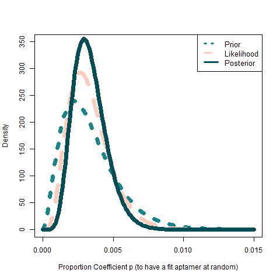
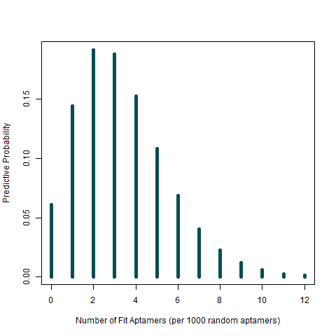

##  TEA convergancy and efficiency model (Albumin)

Genetic algorithm is might be time and resourses intensive process hence if framed decently it be optimized to reach a list of perfect aptamers in fixed number of iterations.

### Genetic Algorithm descriptive model to determine aptamer generation convergance

We have employed Bayesian inferiantial approach to learn about a population proportion of 15s length aptamers. Before considering analyzed data everyone has its belief about a
proportion, for instance that it is normally distributed with mean 0 and variance 1, which is called *prior* which can take any kind of functional form and there is no best prior
only **nerandu zodzio**. After data have been observed we might update our *beliefs* by computing the *posterior*, which can be used for predicting the likely outcomes of a new sample taken 
from the population or any estimate of interest.

TEA user is interested in learning about the habits of 15s length aptamers, in other words what proportion of aptamers get at least 51 affinity score from EFBALite. In this analysis we will think of whole population of aptamers where p represents estimate of proportion of mentioned sequences therefore bayesian inference will let us locate position of p even if it is not know at beginning at all. From Bayesian viewpoint person's belief about the variation or uncertainty of the location of p is presented by a probability distribution placed on this value of p. (any random sample or research can help to form your prior distribution) Also prior is denoted f(p). We wil be using contuious priors: 

  

based on the priors above we have two possible beliefs that this paramater is normally distributed around 0.005 with small uncertainty of 0.001 hence it is mostly likely that parameter is in interval of 0.002 to 0.008. The second belief states that we have beta(2.25, 450) distribution p which is inbetween 0.0005 to 0.01 concentrating on values around 0.005 mostly
(beta(a,b) \propto p^{a-1}(1-p)^{b-1} where a and b hyperparameters are to set user's prior belief; it is quite hard to determine thoseparameters for user himself, so it can be found by percentiles, for instance if you believe 95 percentiles of the distributions are .001 and 0.009 then with functin beta.select (+++medina is first)) the output is hyperparameters of interest for prior.

"success" will be determine by generating a aptamer with kinetic score above 51 and "failure" otherwise. Then the likelihood function is given by binomial distribution
L(p) /propto p^{s}(1-p)^f

Then posterior density for p, by Bayes' rule is obtained by multiplying the prior density by the likelihood
f(p|data) \propto f(p)L(p)
which can be shown to be of the form 
g(p|data) \propto p^{a+s-1}(1-p)^{b+f-1}, where s - number of "successes", f-"failures"

  

- [ ] quantiles from posterior
- [ ] Nustatyti preliminaru skaiciu, min ir max, kuris yra tenkinantis 
- [ ] Naudojant prior is histogramos, likelihood beta(a,b) isskaiciuoti posterior pasiskirstyma ------> bent du prior skirtingus palyginti validuma prior pasirinkimo
- [ ] Apsvarstyti continuous varianta
- [ ] pateikti lentele su isskaiciavimais
- [ ] predictinti is posterior distribucijos ir pateikti lentele su galimais atvejais veliau keliaujanciais i simuliacija
- [ ] surasti literaturoje pagrindima prior belief

###  Neural Network accuracy impact in Genetic Algorithm (probabilistic analysis of false negative case)

- [ ] Pateikti grafika accuracy ir ivercius
- [ ] itraukti n ivercio pasirinkimo naudos analize

### Solution of top aptamer parameter optimization - evading false negative

