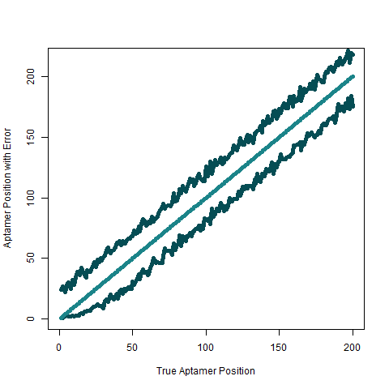

#  TEA convergancy and efficiency model (Albumin)

TEA algorithm is time and resourses intensive process, if modeled decently it can be optimized to reach a list of perfect aptamers in fixed number of iterations with less disorder. Therefore we analyzed two pivotal stages of GA - how long it takes process to converge and extract fit aptamer list and how Alberts model accuracy affects a list of fit aptamers.

## Bayesian probabilistic model to determine its convergence time

We have employed *Bayesian* inferiantial approach to learn about a population **proportion** of **15s** length aptamers. Before considering analyzed data everyone has its *belief* about a
*proportion* which is called *prior*. It can take any kind of functional form of your initial beliefs about a form of proportion of your target (*any related research or collected data could help here*), also there is no best prior
only more fit so it is strongly suggest to try out multiple *priors*. After **event** have been observed we want to update our *beliefs* by *likelihood* distribution which is just distribution of observed data. Finally, *posterior* can be calculated out by "multiplication" of former distributions. *Posterior* can be used for predicting the likely outcomes of a new sample taken 
from the population or any estimate of interest.

***TEA* end-user** is interested in learning about the habits of 15s length aptamers, in other words what proportion of aptamers get at least 51 (*arbitrary value*) affinity score from **EFBA**. Let *p* represent estimate of proportion of distribution of interest which is population of 15s length aptamers (*there are more than billion aptamers this length*). *Bayesian inference* will let us locate position of p even if it is not know at beginning at all. 

From *Bayesian* viewpoint person's belief about the variation or uncertainty of the location of *p* is presented by a probability distribution placed on this value of *p*. We will denote *prior* as *f(p)*.

Our *prior belief* is that proportion *p* mean should be around value 0.003 and 90th percentile to be 0.006 which gives us prior of 

    
  
  <!-- more links here -->

 It is quite hard to determine those parameters for user himself, so it can be found by 90th percentile of the distributions and median which is 50th percentile. *R* package *LearnBayes* has in-build function to do so, follow script `bayesian_inference.R` for more information.

Next, we have to include information from observed data which is scored aptamer sequences from *EFBA*, in file `.\datasets\ga_interim_data\Albumin\position_analysis.csv`. Proportion in our case can be described in simple way, if we generate aptamer with affinity score more than or equal to 51 it is *"success"* - *s* else it is *"failure"* - *f*. From here it is obvious that the likelihood function is given by binomial distribution

    
  
  <!-- more links here -->

Then posterior density for proportion *p*, by *Bayes*' rule is obtained by multiplying the *prior* density with the *likelihood*, refer to the table below.

    
  

    
  

  

It is useful to know that with more extensive observed dataset *posteror" distribution has less uncertainty, in other words variability so it is beneficial to gather as much data as possible. Using *inverse posterior* we are able to get a density function of possible number of fit aptamers of the GA process which generates 1000 aptamers. **Figure below** shows us the outcome results:

  

It is 85.3 % probability to get number of fit aptamers from a list of {1,2,3,4,5,6}, having this we can conclude that:

  - With every new iteration of GA and NN prediction current *top* aptamers cannot/shouldn't decrease in position more than by 7 or more places.

Mean of the *posterior* distribution is ~3.4 which indicates that with large number of GA iterations every iteration algorithm will give out approximately 3.4 fit aptamer, hence
  - On average, we will need 60 iterations to bring 200 long list of fit aptamers.

##  Neural Network accuracy impact in Genetic Algorithm (probabilistic analysis of false negative case)

  

- [ ] pakartoti procesa su kitais error rate, pvz 5-7, 10-12