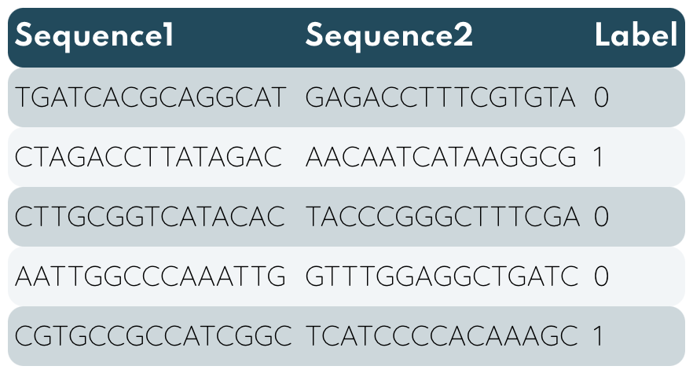

<!-- PROJECT LOGO -->
<br />
<p align="center">
    
  </a>

  <h3 align="center">Fine-Tuning Transformer alBERT </h3>

  <p align="center">
    <a href="https://github.com/"><strong>Explore the wiki »</strong></a>
    
</p>


<!-- TABLE OF CONTENTS -->
<details open="open">
  <summary>Table of Contents</summary>
  <ol>
    <li>
      <a href="#about-bert">About BERT</a>
      <ul>
        <li><a href="#model-advantages">Model advantages</a></li>
      </ul>
    </li>
    <li>
      <a href="#getting-started">Getting Started</a>
      <ul>
        <li><a href="#colab-setup">Colab Setup</a></li>
        <li><a href="#preprocessing-and-data-locating">Preprocessing and Data Locating</a></li>
      </ul>
    </li>
    <li><a href="#tokenization-&-input-formatting">Tokenization & input Formatting</a>
    </li>
    <ul>
        <li><a href="#special-tokens">Special Tokens</a></li>
        <li><a href="#aptamer-length">Aptamer Length</a></li>
      </ul></li>
      <li><a href="train">Train</a>
      <ul>
        <li><a href="#model">Model</a></li>
        <li><a href="#hyperparameters">Hyperparameters</a></li>
      </ul>
    </li>
    <li><a href="#usage">Usage</a>
    </li>
    <li><a href="#model-comparison">Model Comparison</a>
    </li>
    <li><a href="#further-improvements">Further Improvements</a>
    </li>
    <li><a href="#appendix">Appendix</a>
    <ul>
        <li><a href="#saving&loading-fine-tuned-model">Saving & Loading fine-tuned Model</a></li>
        <li><a href="#optimizer-&-learning-rate-scheduler">Optimizer & Learning Rate Scheduler</a></li>
        <li><a href="#weight-decay">Weight Decay</a></li>
      </ul>
    <li><a href="#acknowledgements">Acknowledgements</a>
  </ol>
</details>


<!-- ABOUT THE PROJECT -->
## About BERT
----
2018 was a breakthrough year for NLP, multiple new models like OpenAI's Open-GTP, Google's BERT allowed researchers to fine-tune existing models to produce state-of-art performance with minimal effort. Almost instatly LSTM was largely replaced by BERT (Bidirectional Encoder Representations from Transformers) was released in late 2018, initialy model was employed to Natural Language Processing (NLP), nowadays it finds new applications in variety of fields: machine translation, document generation, biological sequence analysis, video understanding and etc. 

In this project, we will be using BERT modification a Lite BERT (alBERT) that incorporated parameter-reduction techniques to avoid memory limitations of available software, hence has multiple times less parameters to learn and trains 1.7x faster also archieves slightly worse performance. Multiple IGEM teams have tried to apply well-established deep learning methods like CNN, LSTM to predict some features of biological sequences, however those architectures have gradient flaws that especially reveal itself in long sequences. Lets consider why transformers have an edge over former models.

### Model advantages
---
* **Quick Development**
  - Compared to LSTM, BERT has a property of transfer learning, that means you don't have to train model lower layers from scratch, just to apply *head-layer* that suits your task, to get state-of-art results. 

* **Less Data**
  - Best performing deep learning models have millions of parameters to train, therefore model from scratch requires immense size datasets, a lot of time, and hands to create dataset.
  
* **Better Results**
    - It was shown that simple fine-tuning, by adding one layer on the top of BERT, can archieve state-of-art results with minimal task-specific adjustments and it does not suffer from vanishing/exploding gradient (RNN ilness). As a consequence BERT can handle long sequences.

* **Completely Exhaust GPU resources**
    - RNN, LSTM were hardly parallelizable because of recurrent-like architecture, to avoid issue BERT employed the new [attention link] methodology that lets BERT to fully parallelize computations.

## Getting Started 
----
### Colab Setup
Google Colaboratory offers free GPUs which is perfect to train large neural networks like alBERTs. To add GPU select on menu:

`Edit -->  Notebook Settings --> Hardware accelerator --> (GPU)`

This Framework has some time and resourses drawbacks if training dataset is huge or *large* alBERT architecture is chosen, hence we used Google Colaboratory Pro to speed up the process.


### Preprocessing and Data Locating
Model input must follow standard norms - **(Sequence1, Sequence2, Label)**. In case you have list of sequences from **M.A.W.S** you have to run it through *Python* script *pairing.py* to generate labeled dataframe for training.

* Pairing aptamers to fit it into *alBERT*
  ```sh
  python pairing.py -d aptamerListCSV
  ```
* Output format
<p align="center">
    
</a>


### Dependencies

To use a pre-trained transformer *HuggingFace* :hug: provides API to quickly download and use those on a give dataset. API contains thousands of pretrained models to perform many tasks including all *BERT* modifications, however in our case we employed *alBERT* for classification. More information on *pytorch interface*(https://pypi.org/project/transformers)

* Install transformers
  ```sh
  !pip install transformers
  ```

* Download and use model
  ```sh
  from transformers import AutoTokenizer, AutoModel

  tokenizer = AutoTokenizer.from_pretrained(bert_model) 
  bert_model = AutoModel.from_pretrained(bert_model)
  ```

## Tokenization & input Formatting
----
Required formating:
  - *Special* tokens at the beginning and ending of each sentence.
  - Padding & truncation to a single constant length. (papildyti)
  - Differ *real* tokens from *padding* tokens with attention mask.

### Special Tokens

`[CLS]` - For classification tasks, this token is appended in the beginning of first sentence. The significance of this token appears after all embeddings and produce classifier value - prediction.

`[SEP]` - Appears in the ending of *every* sentence and is given to seperate sentences to help model determine something.

`[PAD]` - Is used to balance every input sequence lenghts.

ITERPTI ARCHITEKTUROS PNG
<p align="center">
    
  </a>

* How to looks in our case
  ```sh
  print("Original input: 'ACGTTGAACG', 'CGTTTCGAAT' ")
  print('Tokenized: ', tokenizer("ACGTTGAACG", "CGTTTCGAAT")['input_ids'])
  print('Seperating sequences: ', tokenizer("ACGTTGAACG", "CGTTTCGAAT")['token_type_ids'])
  ```

   ```sh
  Original input: 'ACGTTGAACG', 'CGTTTCGAAT' 
  Tokenized:  [2, 21, 15123, 38, 38, 1136, 1738, 263, 3, 13, 15123, 38, 38, 6668, 1136, 721, 3]
  Seperating sequences:  [0, 0, 0, 0, 0, 0, 0, 0, 0, 1, 1, 1, 1, 1, 1, 1, 1]
  ```

### Aptamer Length

In case dataset consists varying aptamer lengths we have to consider two *BERT* constraints:

* All aptamer pairs must be padded or truncated to a same, fixed length.

* The maximum lump length can't exceed 512 tokens.

Check *Class CustomerDataset* how it should be implemented. However, the last thing to consider is training time, training time is approximaly linearly dependent on *max_len*. (linkas)

In case you have specific data, you can train *tokenizer* on your own. (https://huggingface.co/quicktour/transformers). More considerations can be found in [Further_improvements]
   
## Train
----
(prideti papie pakeiciama heada pritaaintant specifiniui taskui)
Following good practices data was divided up in *train*, *test*, *validation* groups with *80%*, *10%*, *10%* respectively, refer to *pairing.py*.
Next, an iterator for our dataset using *torch DataLoauder* class is created, which helps to save memory compared to simply looping data and whole data loaded to memory.


* train, validation datasets
  ```sh
  train_loader = DataLoader(train_set, batch_size=bs, num_workers=1)
  val_loader = DataLoader(val_set, batch_size=bs, num_workers=1)
  ```
  Now, if we have a worker process, we can make use of the fact that our machine has multiple cores. This means that the next batch can already be loaded and ready to go by the time the main process is ready for another batch. This is where the speed up comes from. The batches are loaded using additional worker processes and are queued up in memory. Optimal number of workers is equal 1.[https://deeplizard.com/learn/video/kWVgvsejXsE]


### Model
[https://huggingface.com/transformers] lists all possible *BERT* alternatives/modifications to choose from.

### Hyperparameters
Authors suggest to use *learning rate = x* (saltinis)
Also, to optimize training time, we suggest to test *batch_size = y*, however it is related to learning rate linearly. (saltinis)


<!-- USAGE EXAMPLES -->
## Usage
----
We have created a function to simplify usage of model:
* How to use model
  ```sh
  test_prediction(net=model, device=device, dataloader=test_loader, with_labels=True, result_file=path_to_output_file)
  ```
**padaryti hugging face modeliu**

_For more examples, please refer to the [Documentation](https://example.com)_ --->GAL CIA IKISTI HUGGINGFACE modeli parsisiuntima

##  Model Comparison
We will consider three transformers: BERT, roBERTa, alBERT.


1. iverciai ir grafikeliai training/val loss
2. test data ivertinimas (gal paieskoti kitu iverciu ) + confuson matrica
----

## Further improvements
  - It is possible to create a tokenizer that learns to distinquish the most important parts of sequence, especially if some base seeks are of interest, for instance hairpins. Fit tokenizer might improve transformers efficiency.
  - In case you want to push model even further and employ *large BERT* modifications/alternatives, you should expand a dataset to help model train that massive number of parameters.
  - Compare multiple models: roBERTa, alBERT, and the best models large version.

## Appendix
### A1.Saving & Loading Fine-tuned Model
### A2.Optimizer & Learning Rate Scheduler
### A3.Weight Decay
1. Kaip pasirinkti optimezeri ir learning rate
2. batch size su learning rate santykis
3. kas yra svorio kritimas
4. ar laudinti modeli, t.y. sioje skiltyje???

## Acknowledgements
----
 
1. [HuggingFace](https://huggingface.co) :hugs: documentation to pick the most suitable model for your task.
2. i paperius apie svorius learning rate ir etc 

